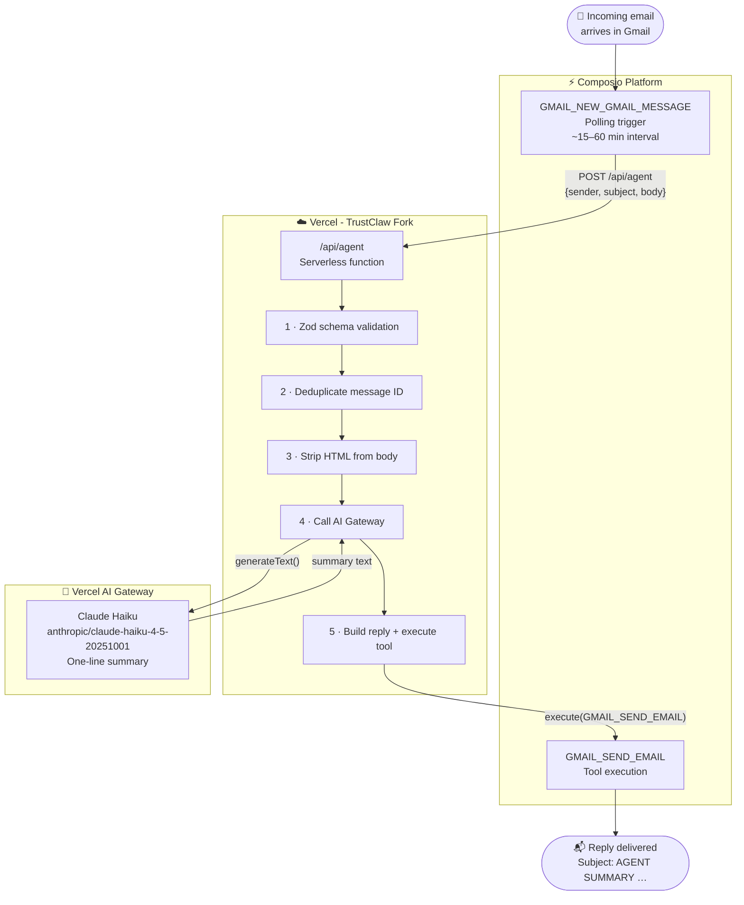
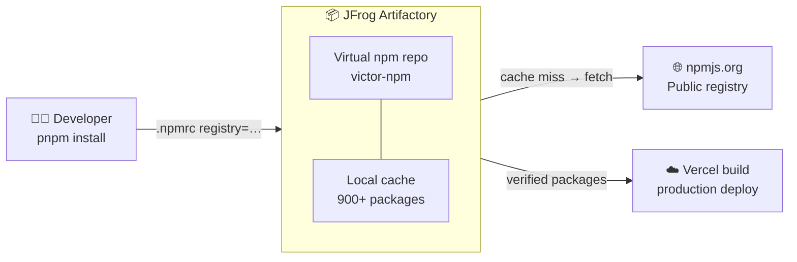

# TrustClaw - JFrog Forward Deployed AI Architect Demo

> **Assignment:** Fork an open-source AI agent, add an email-summarization workflow, proxy all dependencies through JFrog Artifactory, deploy to Vercel, and document the developer experience.
>
> **Live demo:** [trustclaw-jfrog-demo.vercel.app](https://trustclaw-jfrog-demo.vercel.app)
> **Submitted by:** Victor Ramirez · June 2026

---

## What I built

An **autonomous email agent** on top of the open-source [TrustClaw](https://github.com/ComposioHQ/trustclaw) AI platform.

When an email arrives at a connected Gmail account, the agent:

1. Receives the email via a Composio Gmail webhook
2. Sends the body to **Claude** (via Vercel AI Gateway) for a one-line summary
3. Replies to the sender with subject **`AGENT SUMMARY {summary}`** and the original message body

No human in the loop. No manual polling. The agent runs on Vercel serverless infrastructure and wakes up only when triggered.

All **npm packages** are proxied through **JFrog Artifactory** - the project registry is configured to route every `pnpm install` through a private JFrog virtual npm repository, giving the team full visibility, caching, and control over the dependency supply chain.

---

## Architecture

### Runtime - email agent flow



### Build-time - dependency supply chain



> **Why this matters:** Every package installed - including transitive dependencies - is routed through JFrog first. The team gets an immutable audit trail, vulnerability scanning, and the ability to block malicious packages before they reach production.

### Component map

```
┌─────────────────────────────────────────────────────────────────┐
│  GitHub (vhr1975/trustclaw-jfrog-demo)                          │
│  ├── .npmrc               → JFrog Artifactory registry          │
│  ├── src/app/api/agent/   → Email gateway (NEW)                 │
│  │   ├── route.ts         → Webhook handler + agent logic       │
│  │   └── *.schema.ts      → Zod payload validation              │
│  └── scripts/             → One-time trigger setup              │
└───────────────────────────────┬─────────────────────────────────┘
                                │  git push → auto deploy
                                ▼
┌─────────────────────────────────────────────────────────────────┐
│  Vercel (trustclaw-jfrog-demo.vercel.app)                       │
│  ├── Next.js 15 App Router                                      │
│  ├── tRPC API (existing TrustClaw backend)                      │
│  ├── /api/agent  ← Composio webhook target (NEW)                │
│  ├── Neon PostgreSQL + pgvector  (memory store)                 │
│  └── Vercel AI Gateway  (LLM + embeddings)                      │
└─────────────────────────────────────────────────────────────────┘
                                ▲
            ┌───────────────────┤
            │                  │
┌───────────┴──────┐  ┌────────┴───────────────────────────────┐
│  Composio        │  │  JFrog Artifactory                      │
│  · Gmail OAuth   │  │  · Virtual npm registry (victor-npm)    │
│  · Trigger mgmt  │  │  · Proxies + caches all npm packages    │
│  · Tool exec     │  │  · Audit log of every installed package │
└──────────────────┘  └────────────────────────────────────────┘
```

---

## What's new in this fork

| File | Purpose |
|---|---|
| `src/app/api/agent/route.ts` | Email gateway webhook - the entire agent logic lives here |
| `src/app/api/agent/_agent-webhook.schema.ts` | Zod schema validating the Composio webhook payload |
| `scripts/setup-trigger.ts` | One-time script to register the Gmail trigger with Composio |
| `.npmrc` | Routes pnpm to JFrog Artifactory (token via env var) |
| `.npmrc.example` | Redacted version safe to commit - shows the config shape |

Everything else is the upstream TrustClaw fork unchanged.

---

## Tech stack

| Layer | Technology |
|---|---|
| Framework | Next.js 15 (App Router) |
| API | tRPC |
| Auth | Better Auth (username/password) |
| Database | Prisma + Neon PostgreSQL + pgvector |
| LLM | Claude Haiku via Vercel AI Gateway |
| Integrations | Composio SDK (`@composio/core`) |
| Email trigger | `GMAIL_NEW_GMAIL_MESSAGE` (Composio polling trigger) |
| Email send | `GMAIL_SEND_EMAIL` (Composio tool) |
| Registry | JFrog Artifactory (npm proxy) |
| Hosting | Vercel (serverless) |

---

## Setup

### 1. Clone and configure the registry

```bash
git clone https://github.com/vhr1975/trustclaw-jfrog-demo.git
cd trustclaw-jfrog-demo
cp .npmrc.example .npmrc
# Edit .npmrc and replace YOUR_TOKEN_HERE with your JFrog Artifactory token
```

### 2. Install dependencies (routes through JFrog)

```bash
pnpm install
```

All packages are fetched from JFrog Artifactory, which proxies and caches from npmjs.org.

### 3. Configure environment variables

Copy `.env.example` to `.env` and fill in:

| Variable | Purpose |
|---|---|
| `DATABASE_URL` | Neon PostgreSQL connection string |
| `BETTER_AUTH_SECRET` | Session signing key (`openssl rand -base64 32`) |
| `COMPOSIO_API_KEY` | Composio API key (from [app.composio.dev](https://app.composio.dev)) |
| `CRON_SECRET` | Auth for cron routes |
| `JFROG_AUTH_TOKEN` | JFrog Artifactory npm token |

### 4. Deploy to Vercel

```bash
npx @composio/trustclaw deploy
```

Or import the repo directly in the Vercel dashboard. Add the environment variables above in **Settings → Environment Variables**.

### 5. Register the Gmail trigger

Connect your Gmail account in the Composio dashboard, then run:

```bash
COMPOSIO_API_KEY=your_key npx tsx scripts/setup-trigger.ts
```

This registers a `GMAIL_NEW_GMAIL_MESSAGE` polling trigger for the connected account.

### 6. Set the webhook URL in Composio

In the [Composio dashboard](https://app.composio.dev) → **Settings → Webhooks**, set the webhook URL to:

```
https://your-vercel-url.vercel.app/api/agent
```

### 7. Test end-to-end

Send an email to the connected Gmail account. Within ~15 minutes (Composio polling interval), the sender will receive a reply with subject `AGENT SUMMARY {one-line summary}`.

To test immediately without waiting for the poll:

```bash
curl -X POST https://your-vercel-url.vercel.app/api/agent \
  -H "Content-Type: application/json" \
  -d '{
    "metadata": {
      "user_id": "YOUR_COMPOSIO_USER_ID",
      "connected_account_id": "YOUR_CONNECTED_ACCOUNT_ID"
    },
    "data": {
      "message_id": "test_001",
      "thread_id": "thread_001",
      "sender": "Sender Name <sender@example.com>",
      "subject": "Test email subject",
      "message_text": "Your full email body here."
    }
  }'
```

---

## Developer experience observations

The following friction points were encountered during implementation and are worth flagging as product feedback. Ordered by impact.

---

**1. `GMAIL_REPLY_TO_THREAD` silently ignores the `subject` parameter**

This is the most impactful friction point because it is a silent failure. The tool executes, returns `successful: true`, and sends an email - but the `subject` field is quietly discarded. Gmail's threading rules take over and keep the original thread subject regardless of what you pass. The only way to control the reply subject is to abandon `GMAIL_REPLY_TO_THREAD` entirely and use `GMAIL_SEND_EMAIL` to create a new standalone message. This behavior is not documented anywhere. A developer building an agent that requires a specific subject format (like this assignment) will ship broken behavior without knowing it.

**Fix:** Document that `GMAIL_REPLY_TO_THREAD` cannot override the subject, and add a note in the tool description pointing to `GMAIL_SEND_EMAIL` as the alternative when subject control is required.

---

**2. Webhook payload schema not documented for v3**

The Composio trigger fires a payload shaped as `{ metadata: { user_id, connected_account_id }, data: { message_id, thread_id, sender, subject, message_text } }`. This structure does not match any example in the current documentation. Discovery required deploying the webhook, sending a live email, and inspecting the raw logs. Every developer integrating a trigger will hit this gap - and without the actual shape, they cannot write a schema validator or safely destructure the payload.

**Fix:** Add one JSON example of the actual v3 webhook payload to the trigger documentation. This is a single code block that eliminates hours of debugging for every developer who builds on triggers.

---

**3. `TOOL_VERSION_REQUIRED` error with no resolution path**

SDK v0.6.3 throws `TOOL_VERSION_REQUIRED` when executing tools without an explicit toolkit version. The error message provides no next step - no flag to set, no version to specify, no link to documentation. The only fix (`dangerouslySkipVersionCheck: true`) exists in a GitHub issue thread, not in any official documentation or the SDK's own error output. This is a self-service dead end: a developer hitting this at 11pm either opens a support ticket or gives up.

**Fix:** Surface `dangerouslySkipVersionCheck: true` directly in the error message, or document the version resolution flow in the SDK reference so developers can find it without searching GitHub.

---

**4. `ConnectedAccountEntityIdMismatch` - userId/connectedAccountId coupling is opaque**

The connected account belongs to a specific user entity. Passing any other `userId` fails with a cryptic mismatch error. The relationship between user IDs and connected account IDs is not explained in the getting-started docs - you only discover it after hitting the error. The fix is to extract both `user_id` and `connected_account_id` dynamically from the webhook payload metadata rather than hardcoding either value.

---

**5. Polling interval is unpredictable**

`GMAIL_NEW_GMAIL_MESSAGE` is described as polling approximately every 15 minutes, but in practice the interval varies from 15 to 60+ minutes and degrades further after high-volume bursts. For any agent that needs to respond to email in near-real-time, this makes the platform feel unreliable - even when everything is working correctly. A production implementation should use Gmail Pub/Sub push notifications for sub-second delivery.

---

# TrustClaw

**Your AI that does things while you sleep. _Securely._**

A 24/7 personal AI assistant with 1000+ tools via **OAuth** and **sandboxed execution**. Built on the ideas behind OpenClaw, rebuilt from scratch for security. Talks to you on the web or Telegram, remembers what matters, and handles recurring work on autopilot.

> 🚀 **Self-host on Vercel** - one command, ~2 minutes. See below.

[Demo Video](https://x.com/sarahfim/status/2022518658048888916)
[Open Source Launch Video](https://x.com/sarahfim/status/2053989393036145121)
[](https://star-history.com/#bytebase/star-history&Date)

---

## ⚡ Deploy your own in seconds


Click here to use the Vercel Template:

[](https://vercel.com/new/clone?repository-url=https%3A%2F%2Fgithub.com%2FComposioHQ%2Ftrustclaw&project-name=trustclaw&repository-name=trustclaw&env=BETTER_AUTH_SECRET,COMPOSIO_API_KEY,CRON_SECRET&envDescription=Generate%20BETTER_AUTH_SECRET%20and%20CRON_SECRET%20with%3A%20openssl%20rand%20-base64%2032.%20Get%20a%20free%20COMPOSIO_API_KEY%20at%20https%3A%2F%2Fdashboard.composio.dev%2Flogin%3Fflow%3Ddeveloper&envLink=https%3A%2F%2Fgithub.com%2FComposioHQ%2Ftrustclaw%23environment-variables&products=%5B%7B%22type%22%3A%22integration%22%2C%22integrationSlug%22%3A%22neon%22%2C%22productSlug%22%3A%22neon%22%2C%22protocol%22%3A%22storage%22%7D%2C%7B%22type%22%3A%22integration%22%2C%22integrationSlug%22%3A%22upstash%22%2C%22productSlug%22%3A%22upstash-kv%22%2C%22protocol%22%3A%22storage%22%7D%5D&skippable-integrations=1)


### Or use the CLI

```bash
npx @composio/trustclaw deploy
```

That's it. The CLI handles the entire flow.

**Prerequisites:**

- A [Vercel account](https://vercel.com) (`npx vercel login` once)
- A [GitHub account](https://github.com) (`gh auth login` once)
- A free [Composio API key](https://dashboard.composio.dev/login?next=%2F~%2Fproject%2Fsettings%2Fapi-keys&flow=developer) (install the cli `curl -fsSL https://composio.dev/install | bash`)

LLM and embedding calls route through Vercel AI Gateway - **no Anthropic or OpenAI API keys required.**

---

## ✨ Why TrustClaw

| | |
|---|---|
| 🔐 **OAuth Only** | Connects through OAuth. No passwords stored or shared. |
| ⚡ **Zero Setup** | Sign up, chat, done. No API keys or config files. |
| 💤 **Works While You Sleep** | Schedule tasks and let your agent handle them on autopilot. |
| ☁️ **Sandboxed Execution** | Every action runs in an isolated cloud environment that's gone when the task is done. |

### What it can do

- Chat with Claude in a Next.js dashboard or via a Telegram bot
- Long-term memory backed by Postgres + pgvector
- 3-layer context management (pruning, memory flush, summarization compaction) so conversations can run indefinitely
- 1000+ Composio tool integrations (Gmail, GitHub, Slack, Notion, Linear, Calendar, Drive, Stripe, HubSpot, …) gated by the user's connected accounts
- Cron-scheduled agent runs for recurring tasks
- Username/password login via Better Auth

---

## 🛡 Security model

TrustClaw is a deliberate response to the security problems with running AI agents locally:

| | TrustClaw | Vanilla local agents |
|---|---|---|
| **Setup** | Seconds | Hours of config |
| **Credentials** | Encrypted, managed by Composio | Plaintext in local config |
| **Code Execution** | Remote sandbox | On your local machine |
| **Integrations** | OAuth, 1000+ apps | Manual API key setup per app |
| **Skill Security** | Managed tool surface | Unvetted public registry |
| **Audit Trails** | Full action log | None |
| **Revocation** | One click | Find and delete config files |

The design choices:

- **No raw API keys handed to the agent** - Composio brokers OAuth for every tool
- **No code runs on your machine** - every tool call executes in an isolated remote environment
- **No long-lived shell access** - destructive prompt injection from a scraped email can't `rm -rf` your laptop because the agent doesn't have a shell on your laptop

---

## 🏗 Architecture

```
┌──────────────┐    ┌──────────────────────────────────────────┐
│  Web (Next)  │───▶│             Next.js App                  │
│   Telegram   │───▶│  ┌────────────────────────────────────┐  │
│     Cron     │───▶│  │  tRPC API + agent runtime          │  │
└──────────────┘    │  │  (prepareAgentRun → ToolLoopAgent) │  │
                    │  └─────────┬──────────────────────────┘  │
                    │            │                              │
                    │   ┌────────┼─────────┬──────────┐        │
                    │   ▼        ▼         ▼          ▼        │
                    │ Postgres  Redis  AI Gateway  Composio    │
                    │ (pgvector)      (LLM + emb.)             │
                    └──────────────────────────────────────────┘
```

### Tech stack

- [Next.js 15](https://nextjs.org) (App Router) + React 19
- [tRPC](https://trpc.io) for all backend logic
- [Better Auth](https://www.better-auth.com/) (username/password)
- [Prisma](https://prisma.io) + Postgres + [pgvector](https://github.com/pgvector/pgvector)
- [Vercel AI SDK](https://sdk.vercel.ai) + AI Gateway (LLM + embeddings)
- [Composio SDK](https://composio.dev) for tool integrations
- [Tailwind CSS](https://tailwindcss.com) + [shadcn/ui](https://ui.shadcn.com)
- Redis (resumable streams, optional)

---

## ⚠️ Before deploying to production

### Heads-up about the Vercel free (Hobby) plan

TrustClaw runs fine on the free Hobby plan, but Vercel applies two limits that affect the agent:

- **Cron jobs can only run once per day**, and even then they fire anywhere within a 60-minute window of the scheduled hour. Any cron expression more frequent than daily (e.g. hourly, every-30-min) **fails at deploy time** on Hobby. The CLI auto-adjusts `vercel.json` to a daily schedule when it detects you're on Hobby.
- **Functions are capped at 300s (5 min)** - long-running agent turns may time out.

To get **per-minute cron precision** and **up to 800s (~13 min) per function**, upgrade to [Vercel Pro](https://vercel.com/pricing) and re-run the CLI (or manually flip `vercel.json` back to `* * * * *` + bump `maxDuration`).

### Usage caps and billing

TrustClaw ships with Redis-backed per-user rate limiting on the chat, cron, and Telegram agent entrypoints. It is enabled by default and controlled with:

- `RATE_LIMIT_CHAT_PER_MINUTE` / `RATE_LIMIT_CHAT_PER_DAY`
- `RATE_LIMIT_CRON_PER_DAY`
- `RATE_LIMIT_TELEGRAM_PER_MINUTE`
- `RATE_LIMIT_FAIL_MODE` (`open` in development, `closed` otherwise)
- `RATE_LIMIT_ENABLED=false` to bypass all agent entrypoint limits

In production, configure `REDIS_URL` or explicitly set `RATE_LIMIT_FAIL_MODE=open` / `RATE_LIMIT_ENABLED=false`.

If you put a TrustClaw instance on the public internet for strangers to sign up to, add at least:

- A monthly per-user message / tool-call cap enforced server-side
- Billing or invite-only signup if you want to recoup costs

---

## 🧰 Manual setup (local dev)

If you'd rather skip the deploy CLI and run TrustClaw locally:

```bash
pnpm install
cp .env.example .env       # fill in DATABASE_URL, BETTER_AUTH_SECRET, COMPOSIO_API_KEY
pnpm prisma db push        # apply schema (Postgres + pgvector required)
pnpm dev                   # http://localhost:3000
```

For local AI Gateway access, run `vercel link && vercel env pull` to get a short-lived OIDC token, or set `AI_GATEWAY_API_KEY` manually.

For Telegram, point your bot's webhook at `<NEXT_PUBLIC_APP_URL>/api/telegram-webhook` with `TELEGRAM_WEBHOOK_SECRET` as the secret token.

### Required env vars

| Variable | Purpose |
|---|---|
| `DATABASE_URL` | Postgres + pgvector connection string |
| `BETTER_AUTH_SECRET` | Session signing key (32+ random bytes) |
| `COMPOSIO_API_KEY` | Composio tool integrations |
| `CRON_SECRET` | Auth for `/api/cron/*` routes (auto-injected on Vercel) |
| `REDIS_URL` _(optional)_ | Resumable streams + abort flags |
| `TELEGRAM_BOT_TOKEN` _(optional)_ | Telegram bot |
| `TELEGRAM_BOT_USERNAME` _(optional)_ | Telegram bot |
| `TELEGRAM_WEBHOOK_SECRET` _(optional)_ | Telegram webhook auth |

See [`.env.example`](./.env.example) for the full template.

---

## 🤝 Contributing

Bug reports, feature ideas, and PRs all welcome. See [CONTRIBUTING.md](./CONTRIBUTING.md) for setup, project layout, coding conventions, and the PR checklist.

For security issues, email [sarah@composio.dev](mailto:sarah@composio.dev) directly - please don't open a public issue.

## 📝 License

MIT - see [LICENSE](./LICENSE).

Built on top of [Composio](https://composio.dev). Inspired by [OpenClaw](https://github.com/openclaw/openclaw), rebuilt for security.
